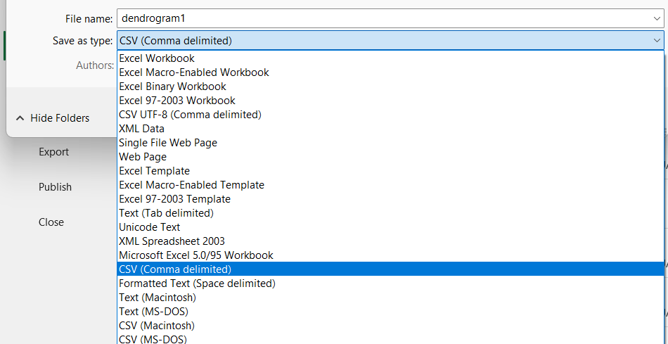
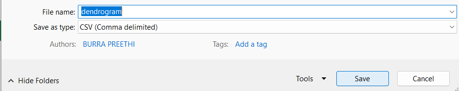
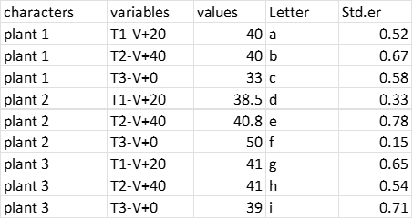
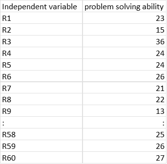
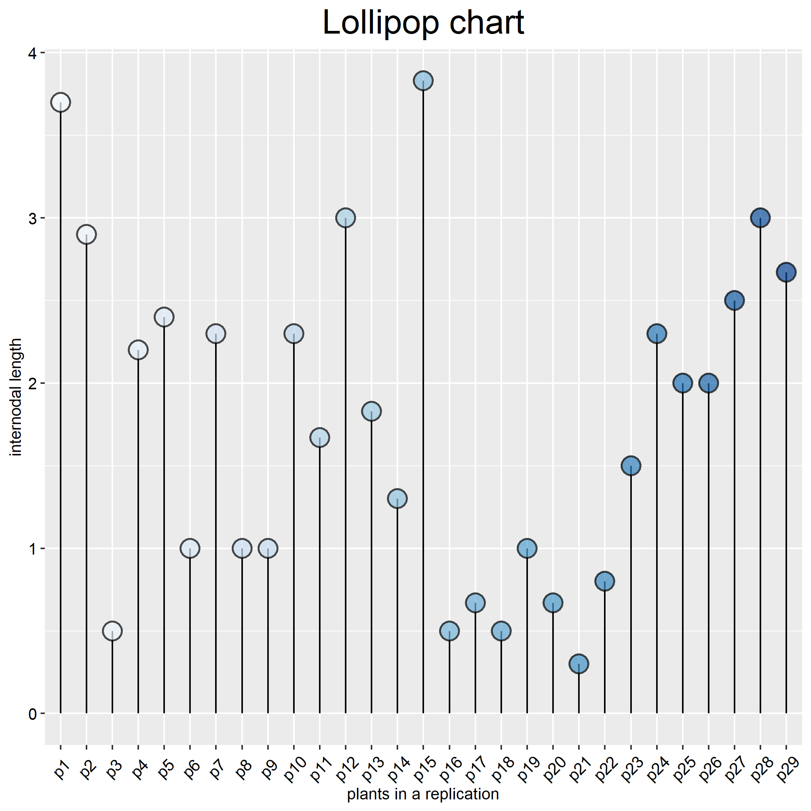
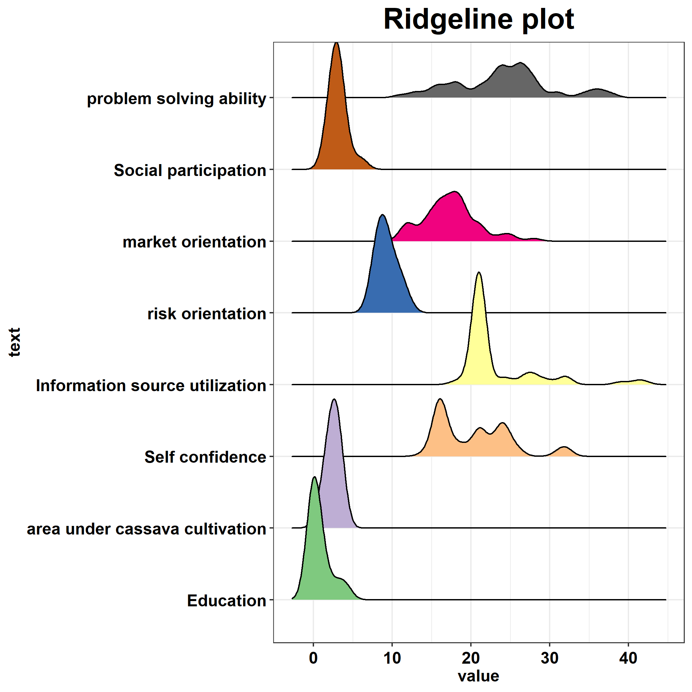

# `grapesDraw`: A shiny R Package for data visualization in Agricultural research   

### General R-shiny based Analysis Platform Empowered by Statistics to DRAW (grapesDraw)  

***Introducing*** `grapesDraw`: ***Empowering Agricultural Researchers
with Dynamic Data Visualization GUI***  

     


`grapesDraw`: a gateway for agri-researchers, crafting an interactive
landscape for data visualization. Developed for students and
researchers, it transforms data into visual narratives with diverse,
user-friendly tools.

## Installation:

Before installing grapesDraw update R t0 its recent version.
`grapesDraw` is created using R 4.3.2 so a version \>=(4.3.2) is
recommended.

It is highly recommended that all packages should also be updated to
recent version before we start.

You can install the development version of `grapesDraw` from
[GitHub](https://github.com/) with:

``` r
# Update to recent version of R
# Ensure all packages are also updated
# copy the entire code below and run

if (!require("devtools"))

install.packages("devtools")

devtools::install_github("pratheesh3780/grapesDraw")
```

## Introduction  


### getting started  


``` r  

library(grapesDraw)

# call the function

draw()  

```

When function `draw()` in `grapesDraw` is called, the dashboard pops up
as shown below:


User need to upload the file in csv format to use grapesDraw.

#### How to save the Excel as CSV format  


Enter the data in Excel sheet (for each data visualization tool,
particular format is specified see [Link to Data Visualization
Section](#Data-Visualization-Tools) details of formats )

Once the data has been entered into the Excel sheet using the format
specified in the subsequent sections (which varies depending on the tool
being used), save the file in CSV format by following the instructions
below:

    step 1: Click on the "file" on the top left corner of the page as shown:

    

step 2: Select “Save As”

Give location where the file has to be saved


step 3: Select “Save as type”



step 4: Choose “CSV(Comma delimited)”


step 5: Type a name for your CSV file

Click on “Save”



**You have now created a CSV file**

### How to operate  


Open the app, select the desired plot


Example datasets can also be downloaded provided in the bottom right
panel


Click on browse, navigates you to the location where your file is saved. Upload the file by browsing as shown below before uploading the file  

check whether it is in **csv file format**


select the x and y axis variables  


click on draw, gives you the result  

The obtained plot can be downloaded in png format.  


## Data Visualization Tools  

- Bar plot
- Barplot with errorbar
- Multiple Bar plot
- Multiplebar with errorbar
- Circular Bar plot
- Lollipop plot
- Modified box plot
- Ridge line plot
- Violin plot
- Heatmap
- Bubble chart
- Correlogram
- Circular packing
- Dendrogram  

### Bar plot  

A barplot (or barchart) is one of the most common types of graphic. It
shows the relationship between a numeric and a categoric variable. Each
entity of the categoric variable is represented as a bar. The size of
the bar represents its numeric value.

**How to enter data into excel**

Enter the data into excel in such a way that first column should be categorical variables (x-axis variable) and second column should be corresponding numeric values (y-axis variable). These excel sheets are to be converted into csv file format.

#### Example dataset  


### Barplot with errorbar  

Error bars are used to indicate the error or uncertainity in a observed
data. It gives the idea how precise a measurement is, or how far from
the reported value the true value might be. Values of the error bars (on
the top of each bar) must be computed before plotting the graph. Three
different values (Standard deviation(SD), Standard error(SE) and
confidence interval(CI)) are commonly used for error bars.

**How to enter data into excel**  

Enter the data in such a way that it has four columns, first column treatment (t), second column with the responses (r), third column with the corresponding significant letters and fourth column with the error indicated as standard error (se), standard deviation (sd) and confidence interval (ci). This is done using the formula, error min = r-1.96xci and error max = r+1.96xci.

#### Example dataset  


  

### Multiple Bar plot  


Multiple bar plots, also known as grouped and stacked bar plots, are
used to depict a numerical value for numerous entities organized into
groups and subgroups. A bar plot is actually utilized to demonstrate the
relationship between a numerical and a category variable.  


**How to enter data into excel**  

Enter the data into excel in such a way that first column should be categorical variables for the group (defined as characters in the example dataset) and second column should be sub group (defined as variables in the example dataset, is a colouring variable, which is to be filled with colours) such that each group should have equal number of sub groups (colouring variable) and each sub group with a numerical value(denoted as values in example dataset) corresponding to it in the third column.

#### Example dataset  


  


### Multiplebar with errorbar  

combination of multiple bar and the error bar give the multiple error
bar.

**How to enter data into excel** Enter the dataset same as that for the
multiple bar, in addition add two more columns, one for significant
letters and corresponding value of error indicated bt se or sd or ci.

#### Example dataset  



  

### Circular Bar plot  

A circular bar plot is a bar plot, with each bar displayed along a
circle instead of a line. circular bar chart is very eye catching and
allows a better use of the space than a long usual bar plot. The
circular bar plot is visually appealing, but it renders comprehending
the variations between bar sizes more challenging. Thus, circular bar
charts make sense only when there are a large number of bars to display
and a clear pattern emerges.

**How to enter data into Excel**  

Enter the data in such a way that it consist of two columns: first column with the categorical variable (denoted as x axis variable in the example dataset) and the numerical value (denoted as y axis variable in the example dataset) . Each variable takes a numerical value represented as the length of the bar. Refere example dataset if any doubt.

#### Example dataset  




### Lollipop plot  

A lollipop plot is basically a bar plot, where bar is transformed into a
line (stem) and a dot(circle). It shows the relationship between a
numeric and categorical variable. The lollipop plot is used in the same
way that a barplot is. However, it is more appealing and conveys the
more information as well. It is particularly helpful when there are
numerous bars of the same height.

**How to enter data into the excel**  

Enter the data in such a way that it consist of two columns: first column with the categorical variable (denoted as x axis variable) and the numerical value (denoted as y axis variable) . Each variable takes a numerical value represented as the length of the bar. Refere example dataset if any doubt.

#### Example dataset  




### Modified box plot  

A boxplot or a box or whisker plot is a type of chart often used in
exploratory data analysis. Boxplots are a commonly used chart that
compares a distribution of several groups. A boxplot summarizes the
distribution of a continuous variable. It shows the five-number summary
of a set of data: including the minimum score, first (lower) quartile,
median, third(upper) quartile, and maximum score. Whereas modified
boxplot is nothing but adding jitter point on top of the box plot if the
data is not too large, this makes the graphic more insightful.

**How to enter the data into the excel**  

Enter the data in such a way that it consists of 2 columns one with numeric values (to be represented on y axis) and other with grouped variables (to be represented on x axis).

#### Example dataset   


  


### Ridge line plot  

A ridgeline plot also called joy plot sometimes, represents the
distribution of a numeric value for several groups. Distribution can be
represented using histograms or density plots, all aligned to the same
horizontal scale and presented with a slight overlap allowing to use
space more efficiently.

**How to enter data into the excel**  


Enter the dataset in such a way that it  consists of  2 columns: first should be categorical grouped variables and numerical values of each variable in second column corresponding to it.  

#### Example dataset  




### Violin plot  


Violin plot is a tool to visualize distribution of numeric variables for
one or several groups, where each violin represents a group or a
variable. here the shape represents the density estimate of the
variable: the more data points in a specific range, the larger the
violin. It is really close to a boxplot, but allows a deeper
understanding of the distribution. Violin plot is a powerful data
visualization tool since it allows to compare both the ranking of
several groups and their distribution.

**How to enter data into the excel**  

Enter the data in such a way that it consists of 2 columns one with numeric values (to be represented on y axis) and other with grouped variables (to be represented on x axis).

#### Example dataset  


### Heatmap  

A heatmap is a graphical representation of data where the individual
values contained in a matrix are represented as colours. Heatmap is
really useful to display a general view of numerical data, not to
extract specific data point. Higher the intensity of the colour higher
the correlation.

**How to enter data into excel**  

Enter the data in such away that it consists of 3 columns: first column should be treatment names, second column should be replication in group while the third column should be corresponding numerical value.

#### Example dataset  


### Bubble chart  

A bubble plot is a scatterplot where a third dimension is added: the
value of an additional numeric variable is represented through the size
of the dots.

**How to enter data into the excel**  

Enter the data in such a way that it consists of four columns first column with treatment name (categorical variables), second and third columns with x and y axis numerical values and fourth column should be numerical value to represent the size of the dot.

#### Example dataset  


### Correlogram  

A correlogram or correlation matrix allows to analyse the relationship
between each pair of numeric variables of a dataset. The relationship
between each pair of variables is visualised through the symbols that
represents the correlation such as circle, ellipse, square and pie.
Correlogram is really handy for exploratory analysis than to
explanatory.

**How to enter the data into excel**  

Enter the data in such a way that it consists of columns wherein first row should be categorical (parameter names) variables and numerical values in the corresponding rows under the columns.

#### Example dataset  


### Circular packing  

The size of each circle is proportional to a specific value, what gives
more insight to the plot. It is like a barplot, but circle size is used
instead of bar length. It is close to a bubble plot, but X and Y
positions do not mean anything. It is a circle version of a barplot.

**How to enter data into excel**  

Enter the data in such a way that it consists of two columns one with Categorical variable and other with numerical value corresponding to each variable.  

#### Example dataset  


  


### Dendrogram  

A dendrogram (or tree diagram) is a network structure. It is constituted
of a root node that gives birth to several nodes connected by edges or
branches. The last nodes of the hierarchy are called leaves. Cluster
dendrogram can be considered as a part of a whole as it illustrates how
data points are grouped and organized into a hierarchy of clusters.

**How to enter the data into the Excel**  


Enter the data in such away that it gives a matrix where each row is a sample, and each column is a variable. Hierarchical clustering is performed on a square matrix that provides distance between samples.  


#### Example dataset  


  


## Customization of the plot  


In the GUI two control panels were added for the customization of plots.
Basic control panel and an Advanced control panel.

### Basic control panel  


Explore your visualization with basic control panel, where color
schemes, legend positions, and background themes can be adjusted. Toggle
the switch for an advanced manual control panel, diving into the depths
of customization


A variety of themes are provided from `ggplot2`:  

- "normal"    : theme_bw()  
- “economist” : theme_economist()
- “grey” : theme_gray()
- “minimal” : theme_minimal()
- “light” : theme_light()
- “void” : theme_void()
- “tufte” : theme_tufte()
- “stata” : theme_stata()
- “wsj” : theme_wsj()
- “calc” : theme_calc()
- “hc” : theme_hc()  


#### Advanced control panel  


Improve your customization with an advanced manual control panel
featuring interactive controls, such as sliders for text size adjustment
and dropdowns for font face, type, and color. Tailor your axis labels,
titles, legends, and plot text.


